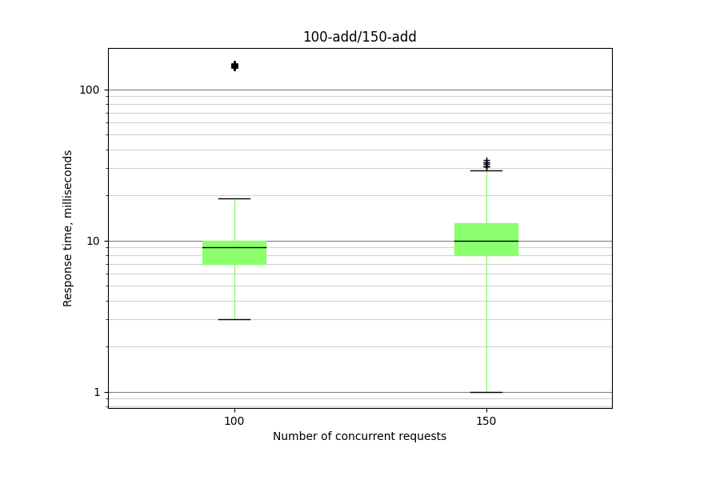
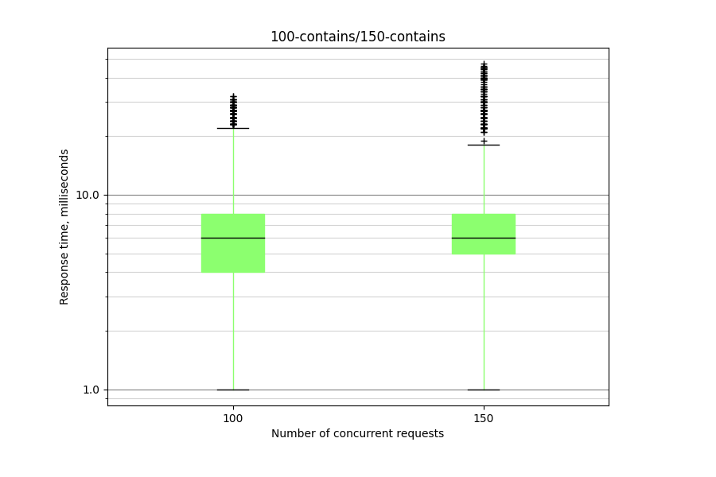
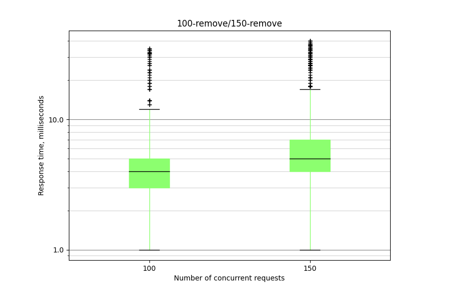

# Docker
To start working with the application, run following commands:
```
docker build -t students-exams:latest .
docker run -p 8080:80 students-exams:latest
```

# Boxplots
Box diagrams of the distribution of query execution of each type in the absence of another load at specified load levels:
* Number of Threads (users): 100/150;
* Ramp-up period (seconds): 0;
* Loop Count: 10.

## CoarseHashSet


## StripedCuckooHashSet




## Add (90%), Contains (9%), Remove (1%)
The number of clients resulting in a 10-second timeout failure: 1500.

Approximate number of entries in the dictionary: 250.
